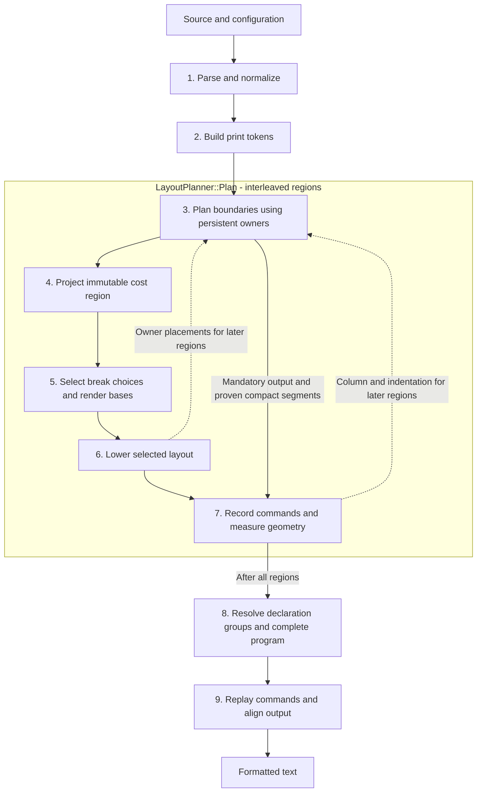

# Architecture

## Overview

`strictfmt` formats one source text at a time. [FormatSourceText](../src/format/format.cpp) parses the source, formats the resulting model, and restores the original line ending style. Optional validation runs the pipeline again on its output to check parsing and idempotence.

Formatting is an interleaved pipeline: the planner projects, solves, and lowers each region before proceeding to the next. A region receives the column, indentation, and owner placements selected for preceding regions. Lowering and emission do not initiate region planning or solving. Final emission starts only after the output program is complete.

The diagram shows the current data flow. Solid arrows carry a region's data forward; dashed arrows carry context to later regions, without revisiting earlier choices.

| Stage | Implementing methods | Data produced |
| --- | --- | --- |
| 1. Parse and normalize | [ParseFormatModel](../src/format/impl/format_model_parse.cpp), [BuildFormatModel](../src/format/impl/format_model_builder.cpp), [NormalizeSyntaxNode](../src/format/impl/format_model_normalize.cpp) | Formatter-owned `FormatModel`, with normalized syntax and trivia. |
| 2. Build print tokens | [BuildPrintTokens](../src/format/impl/format_print_token_builder.cpp) | `PrintToken` sequence with source identities, syntax traits, and initial spacing. |
| 3. Plan boundaries | [LayoutPlanner::Plan, PrintOne, FlushPendingTokens](../src/format/impl/format_pretty_printer.cpp), [FormatLayoutTree::FormatLayoutTree, CompleteModel](../src/format/impl/format_layout_tree.cpp) | Buffered regions and their incoming context, backed by persistent owners and complete item models. |
| 4. Project region | [FormatLayoutTree::AddRegion](../src/format/impl/format_layout_tree.cpp), [ProjectFormatLayout](../src/format/impl/format_layout_projection.cpp) | Retained region tokens and an immutable `FormatBreakModel`. |
| 5. Solve | [SolveFormatBreaks](../src/format/impl/format_break_solver.cpp) | Owned `FormatBreakSolution`; no printer or output callback is supplied to the solver. |
| 6. Lower | [LowerFormatLayout](../src/format/impl/format_layout_lowerer.cpp) | Selected token writes and boundaries through `FormatLayoutWriter`, plus persistent list, chain, and block placements. |
| 7. Record and measure | [FormatLayoutWriter::WriteToken, BreakLine](../src/format/impl/format_layout_writer.cpp), [FormatLayoutProgramBuilder::Write, WriteComment, NewLine](../src/format/impl/format_layout_program.cpp) | Commands with resolved indentation anchors, measured physical state, and source-token line ranges. |
| 8. Complete program | [FormatLayoutProgramBuilder::Finish](../src/format/impl/format_layout_program.cpp), [FormatDeclarationLayout::Resolve](../src/format/impl/format_declaration_layout.cpp), [FormatLayoutTree::Complete](../src/format/impl/format_layout_tree.cpp) | Completed `FormatLayoutProgram`, including declaration-group separators. |
| 9. Emit text | [EmitFormatLayoutProgram](../src/format/impl/format_layout_program.cpp), [FormatOutput::Finish](../src/format/impl/format_output.cpp) | Physical text with final comment and macro-backslash alignment. |

[PrintFormatModel](../src/format/impl/format_pretty_printer.cpp) enforces the final planning/emission boundary: `Plan` returns a `unique_ptr<const FormatLayoutTree>` before `EmitFormatLayoutProgram` is called. Replay consumes only the completed program and output settings. Its syntax pointers are opaque grouping identities; it neither traverses syntax nor consults the solver.

Lowering uses the concrete [FormatLayoutWriter](../src/format/impl/format_layout_writer.h), which holds the program builder, read-only owner lookup, and a value snapshot of the region's source-token view, structural indentation, indent width, and macro continuation mode. Neither the lowerer nor the writer receives a planner object or callback. The planner also uses this writer for comment placement at mandatory boundaries, keeping that behavior in one place.

The layout tree retains complete source ownership for the whole operation. It indexes owners directly by position in the immutable contiguous syntax-node storage; independently constructed syntax trees use identity lookup. Model construction and projection reuse one dense selection workspace per file. Each sequential selection has a new generation, so earlier selections stay invisible without clearing the whole table; results retain no workspace references. Mandatory boundaries delimit cost regions without discarding enclosing owners. Model node storage, list items, and span buffers use a file-owned allocation pool, released after the models are destroyed. List-item growth bookkeeping stays in the builder; retained models store only item spans. Complete models are materialized once; projections retain their origins, and regions and solutions remain valid until formatting ends. Selected list, chain, and block placements belong to persistent owners. For example, [LayoutLowerer::RecordSplitLists](../src/format/impl/format_layout_lowerer.cpp) records a list's placement before [LayoutPlanner::FlushListItem](../src/format/impl/format_pretty_printer.cpp) reads `SelectedItemIndent` to continue after a comment. Declaration owners retain structural indentation independently of header continuations.

The program builder measures operations with the same physical state machine used by replay, without its final alignment pass. Every recorded write carries a resolved indentation anchor, so later line boundaries cannot reset it. Declaration-group resolution requests complete models for eligible declaration owners and measures their selected token lines, excluding nested compound bodies; it does not depend on which enclosing models region planning happened to build. Inserting these blank lines changes neither the geometry of subsequent regions nor their selected layouts. No layout decision depends on final emission.

Print-token construction materializes canonical known-token text and immutable syntax traits used by later compact checks, spacing, and break-model construction. Ancestry traits are propagated during the same syntax traversal that emits tokens. Syntax normalization materializes targeted immutable descendant facts on their owning nodes when later formatting would otherwise repeat the recursive query. Adjacent-source spacing is cached once and reused only when consecutive source indices prove that the same tokens remain adjacent in a buffered segment; spacing at formatter-controlled segment boundaries is recomputed.

## Lowering Selected Layouts

[Lowering](glossary.md) makes the selected structural layout concrete. The solver's answer refers to model nodes: for example, a list uses one item per line, its items have indentation level 2, and its closing delimiter has indentation level 1. [LayoutLowerer::LowerDelimitedNode](../src/format/impl/format_layout_lowerer.cpp) walks that list and translates the answer into writes and boundaries: write the opener, break to level 2, write each item and separator with a break between items, then break to level 1 and write the closer.

The writer records those operations as `FormatLayoutProgram` commands and resolves their indentation anchors. The lowerer also records owner placements needed by later regions. It follows choices already selected by the solver; it does not search for a layout. Final emission is a later step that replays the recorded commands into text and performs alignment.

## Module Ownership

- `src/strictfmt_main.cpp` owns the standalone executable `main` entry point.
- `src/format/strictfmt_cli.h|cpp` own the embeddable `RunStrictfmtCli(argc, argv)` entry point.
- `src/format/format.h|cpp` own source text formatting, line ending preservation, and optional output validation.
- `src/format/format_cli.cpp` owns the end-user formatter command orchestration: input collection, configuration lookup, ignore filtering, parallel file formatting, output routing, summaries, and exit codes.
- `src/format/impl/format_args.h|cpp` own command-line option parsing and usage text.
- `src/format/impl/format_diff.h|cpp` own greedy line synchronization and unified-diff emission for `--diff`.
- `src/format/impl/format_break_cost.h|cpp` own structural prefix-depth adjustments and final break-cost subtree discounts, including the no-discount traversal shortcut.
- `src/format/impl/format_layout_lowerer.h|cpp` own recursive lowering of selected region layouts and recording list, chain, and block placements on persistent owners.
- `src/format/impl/format_layout_writer.h|cpp` own translation of selected token writes and boundaries into program commands, including syntax-based comment placement and macro continuation handling from an explicit region context.
- `src/format/impl/format_layout_program.h|cpp` own output commands, immutable owner indentation anchors, exact planning measurements, and syntax-independent replay.
- `src/format/impl/format_break_model.h|cpp` own the break model data structures and shared break model predicates.
- `src/format/impl/format_break_model_builder.h|cpp` own conversion from print tokens to break models with builder-local token selection and spacing.
- `src/format/impl/format_layout_projection.h|cpp` own cost-region projection, preserving complete structural roles, boundary delimiters, and separator trivia.
- `src/format/impl/format_layout_tree.h|cpp` own stable source-layout owners, immutable complete item models, and retained cost-region models and solutions.
- `src/format/impl/format_break_model_dump.h|cpp` own serialization of break-decision trees.
- `src/format/impl/format_break_model_inline_helpers.h` owns small inline accessors for optional break model tokens.
- `src/format/impl/format_compact_layout.h|cpp` own exact compact physical-line measurement and its immutable-model cache.
- `src/format/impl/format_delimiter_stack.h|cpp` own shared transparent parenthesis-stack recognition for solving and emission, preserving their distinct closing-blank-line policies.
- `src/format/impl/format_chain_continuation.h|cpp` own persistent complete-chain placements, shared operator constraints, and render bases across mandatory boundaries.
- `src/format/impl/format_list_continuation.h|cpp` own persistent list placements and lexical boundary queries across blocks and preprocessor directives.
- `src/format/impl/format_syntax_helpers.h` owns shared direct-child lexical queries used by structural printing and continuation planning.
- `src/format/impl/format_syntax_map.h` owns compact append-only syntax identity tables for layout ownership and token selection; growth invalidates table references, while syntax identities remain stable.
- `src/format/impl/format_break_solver.h|cpp` own the break optimizer; see [break_solver.md].
- `src/format/impl/format_choice_history.h|cpp` own immutable choice-history storage, lookup, concatenation, and materialization.
- `src/format/impl/format_candidates.h|cpp` own layout-candidate value storage, overflow accounting, cost comparison, continuation-state equivalence, and dominance pruning.
- `src/format/impl/format_break_solution.h` owns the materialized layout data shared by solving, lowering, and diagnostics.
- `src/format/impl/format_value_profile.h|cpp` own the sparse value profile shared by break optimization costs.
- `src/format/impl/format_config.h|cpp` own formatter configuration, ignore files, upward discovery, inheritance, parsing, and caching.
- `src/format/impl/format_declaration_layout.h|cpp` own declaration-group scheduling and boundary resolution from the selected output program.
- `src/format/impl/format_model_text_stats.h` owns optional model-to-text phase timings.
- `src/format/impl/format_include_sort.h|cpp` own include run normalization, grouping, main-include detection, and sorting.
- `src/format/impl/format_model.h|cpp` own format model storage/construction, parent/depth maintenance, and shared node-dependent compact-body facts.
- `src/format/impl/format_syntax_info.h|cpp` own node kinds, `SyntaxNodeClass`, canonical spellings, parser-symbol mappings, and immutable syntax metadata; category checks must use `SyntaxNodeClass` helpers, not duplicated `SyntaxNodeKind` lists, with exact kind comparisons reserved for one concrete syntax rule.
- `src/format/impl/format_model_builder.h|cpp` own conversion from tree-sitter nodes to the format model, source trivia, declarator-field preservation, and opening include-run grouping. Source-range validation also enforces adjacency for split literal tokens, allowing line splices.
- `src/format/impl/format_model_normalize.h|cpp` own bottom-up syntax normalization and materialized semantic facts on formatter-owned nodes.
- `src/format/impl/format_preprocessor_validation.h|cpp` own preprocessor placement validation.
- `src/format/impl/format_model_dump.h|cpp` own syntax-tree and break-tree dump command orchestration.
- `src/format/impl/format_model_parse.h|cpp` own tree-sitter parser setup, macro-category callbacks, and parse-to-format-model wiring.
- `vendor/tree-sitter/tree-sitter-cpp/src/scanner.c` owns custom tree-sitter external tokens, including runtime-configured macro identifiers, raw string delimiter state, and preprocessor directive newline ownership; see [scanner.md](scanner.md).
- `src/format/impl/format_print_token.h` owns print-token data and borrowed-source metadata.
- `src/format/impl/format_print_token_builder.h|cpp` own normalized syntax traversal through a private inherited context, centralized print-token construction, ancestry facts, comment continuations, and initial adjacent-source spacing.
- `src/format/impl/format_pretty_printer.h|cpp` own mandatory boundaries, structural indentation, and coordination of region projection, solving, and program construction.
- `src/format/impl/format_output.h|cpp` own physical text, columns, pending line indentation, macro continuation suffixes, and deferred comment and continuation alignment through a syntax-independent output buffer.
- `src/format/impl/format_preprocessor_text.h|cpp` own directive text canonicalization, preserved payload indentation, and conditional payload terminal-comma normalization.
- `src/format/impl/format_raw_macro.h|cpp` own raw macro replacement whitespace normalization, identification of alignable continuation suffixes, and the raw preprocessor line-preservation helpers used by the pretty printer.
- `src/format/impl/format_string_literals.h|cpp` own safe adjacent-string spelling joins and escaped-newline split requirements.
- `src/format/impl/format_spacing.h|cpp` own print token text/width accessors, classification, and spacing rules.
- `src/tools/tools_common.h|cpp` own shared tool helpers for paths, recursive discovery, file lists, source lines, include text, counts, and lightweight string operations.
- `src/tools/tools_parallel.h|cpp` own tool concurrency parsing, default worker selection, and indexed parallel execution.
- `src/tools/tools_progress.h|cpp` own elapsed-time formatting and terminal progress rendering.
- `src/util/file_path.h|cpp` own portable path wrappers and binary file I/O.
- `src/util/strings.h|cpp` own general string normalization, splitting, matching, joining, and sorting helpers.
- `src/util/utf8.h|cpp` own UTF-8 character counting shared by layout estimation and emission.
- `vendor/unicode/` owns the pinned grapheme property data and conformance fixture; see its [README](../vendor/unicode/README.md).

## Build Ownership

- `strictfmt_tree_sitter_runtime` owns the vendored static tree-sitter runtime, subject to the upstream-runtime constraint below.
- `strictfmt_tree_sitter_cpp_grammar` owns the vendored generated C++ grammar and custom scanner; see [scanner.md](scanner.md).
- `strictfmt_util` owns utility modules shared by CLI and formatter code.
- `strictfmt_core` owns the formatter core pipeline from source text through formatted source.
- `strictfmt_cli` owns command-line and embedding support on top of `strictfmt_core`.
- `strictfmt` owns the standalone executable when `STRICTFMT_BUILD_STANDALONE` is enabled.
- `strictfmt_tests` owns the custom test runner target backed by `tests/format/format_test.py` when Python is available.
- `StrictfmtFormatTests` owns the CTest entry for the formatter test suite when Python is available.
- `strictfmt_utf8_tests` and `StrictfmtUtf8Tests` own the Unicode utility test executable and its CTest entry.
- `strictfmt_layout_tests` and `StrictfmtLayoutTests` own the internal layout-contract test executable and its CTest entry.

## Upstream Tree-Sitter Runtime

Using an unmodified upstream tree-sitter C runtime is a hard architectural constraint. The runtime source, public and parser-facing APIs, ABI, parse-table representation, and table readers vendored under `vendor/tree-sitter/tree-sitter/` must match the pinned upstream release; strictfmt-specific patches to them are not permitted. Parser customization belongs in the C++ grammar, the custom external scanner, or strictfmt's parser/model integration.

The generated C++ parser must fit every limit imposed by the pinned upstream generator and runtime. In particular, parser state ids and parse-action indexes must remain representable by the upstream 16-bit table ABI and therefore must not exceed 65,535. A grammar change that exceeds an upstream limit must be reduced, redesigned, or rejected. Widening runtime or generated-table types, post-processing generated files to change their ABI, or maintaining a private runtime fork is not an acceptable solution.

Generated-source compaction may change only the C spelling of values emitted by the stock generator. It must preserve every table value, table dimension, and runtime-facing structure, keep the parser in one source file, and require no runtime or parser-header change. Re-encoding or splitting parse tables is not source compaction and is not permitted by this exception.

## Parser Goals

The grammar and parser aim to accept all legal C++ code, including code with macros that would otherwise require slow macro expansion, and produce a useful syntax tree showing its structure and the roles of its elements. Rejecting invalid C++ code is not a goal.

## Structural Genericity

Grammar must model C++ constructs generically, following the shape of the C++ language rather than the source samples. Every piece of the grammar must work and parse in a recursive way. A grammar rule must not encode a shallow convenience shape that only works for the current nesting level or current fixture; if adding one more nesting level would require another special case, the rule is not generic enough. If a construct can appear where another C++ construct can appear, the grammar must compose through the same recursive nonterminal.

Resolving syntactic ambiguity in the grammar is a hard architectural constraint. Grammar conflicts and precedence must select the intended complete recursive production. Later formatter stages must consume that selected syntax category as-is; the format model, spacing logic, and break model must not reinterpret expression tokens as declarations, templates, or other competing syntax.

Project-specific tokens are used only for intentionally non-C++ macro fragments or scanner-owned lexical features documented in [scanner.md](scanner.md) and are taken from configuration, not hard-coded. Otherwise, structured grammar productions compose with existing C++ declarators, type names, expressions, and statements.

Composite syntax must remain recursive in both the tree-sitter tree and the formatter model. A grammar token or formatter leaf must not hide any composite source span. A macro replacement with no complete structured parse is the sole opaque-source exception. The only other leaves are ordinary lexical tokens.

The format model preserves grammar declarator, condition, and name field roles through wrapper flattening, so declaration and preprocessor-header boundaries do not depend on spelling or expression shape.

Formatter behavior follows the same principle: rules use shared structural or configured semantic categories and apply at every supported recursion depth. Source spelling, incidental parser wrappers, and golden-fixture shape must not create one-off formatting categories.

## No Silent Failure

Reporting failures is a hard architectural constraint. Every failure to parse input,
and every failed check performed during output validation, must propagate as an
explicit error to the caller and a nonzero command-line exit status. Never restore
original text, report a failed transformation as unchanged success, or suppress a
diagnostic to make a formatting run or test pass. Normal formatting performs one
pass; optional validation reparses its output and checks that formatting that
output again produces identical text. Validation failures must prevent the affected
output from being emitted or written.
